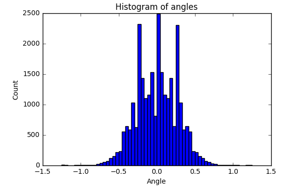

# Behavioral cloning

The current project provides a solution to the project 3 / Term 1 of the Self-driving car nano-degree by udacity.
The goal of the project is to train a deep neural network to learn to predict the driving angle given an image from the car's camera.

The steps of this project are the following:

- Use the simulator to collect data of good driving behavior
- Build, a convolution neural network in Keras that predicts steering angles from images
- Train and validate the model with a training and validation set
- Test that the model successfully drives around track one without leaving the road
- Summarize the results with a written report

## Submitted files

My project includes the following files:

- model.py: contains the script to create and train the model
- drive.py: for driving the car in autonomous mode
- model.h5: contains a trained convolution neural network
- README.md: summarizes the results

## Model Architecture and Training Strategy

I used the Comma.ai model since it has been successfully used on a similar problem. The only modification was the input image size.

In short the comma.ai deep learning model consists of a sequence of three convolution layers and RELUs. The output of this network is flattened and passed into a neural network with one hidden layer and drop-out and RELUs between the input hidden and hidden output layers.

The architecture of the network is shown below:

### Attempts to reduce overfitting in the model

To reduce overfitting, drop-out layers have been used. Also I have splitted the input dataset into training and validation set and the accuracy of the model has been evaluated on the validation set.

### Model parameter tuning

The model used an adam optimizer, so the learning rate was not tuned manually.

## Data collection

To train the network, I used the dataset provided by udacity. I used the center images together with the left and right camera image with added value on the angle +/- 0.25 rad. I collected additional data mostly on cases where the car failed to drive well autonomously (e.g. on turns). 

### Data evaluation

By examining the udacity dataset, I notice that the dataset is unbalanced. There are a lot of cases of zero angles (shown below).

### Data pre-processing

To balance the dataset, I filter the original dataset in order to randomly remove zero angle instances. 
The histogram of the **filtered** dataset is shown below: 

Moreover, to balance the left and right turns, I vertically revert the images and add them with the opposite sign to the dataset. 
The histogram of the **final filtered** udacity dataset with **balanced left/right images** is shown below: 

The histogram of the **self-collected** dataset is shown below

### Image pre-processing

The original image is pre-processed in the following way:

- crop the image ignoring the upper part (sky) and the lower part (car chasis) of the image from 160x320 to 78x320
- downsample the image to 39x160

| Input image | Cropped image |
|---|---|
|  |  | 

## Training of the network

I trained the network with different number of epochs and batch sizes.
I finally selected 150 as batch size. 
For epoch number, I draw the below graph and found that after 12 epochs the network started probably to overfit. So, I used 12 epochs.

## Running the model on Track 1

The car manages to drive on Track 1 without driving outside the road or touching any lane border. 
You can find a small video online here: https://youtu.be/duAp7eDKXAQ
